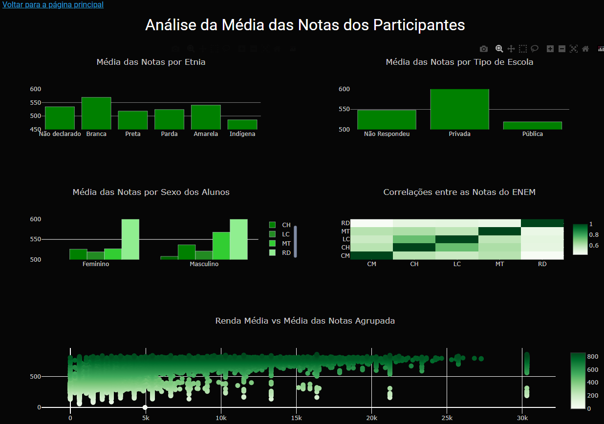

Este projeto se dedica à análise de um subconjunto selecionado dos microdados do ENEM 2022, fornecidos pelo INEP. Utilizando a ferramenta Dash para Python, objetivamos extrair insights desses dados para fins didáticos.  As visualizações e resultados aqui descritos visam servir como recurso educacional para aqueles interessados em compreender tendências e padrões do ENEM. Todo crédito referente à coleta e disponibilização dos microdados é do INEP/MEC. Recomenda-se que interessados acessem a fonte oficial do INEP para obter o conjunto completo de dados.
Vale dizer que esse projeto está em produção, ainda.

